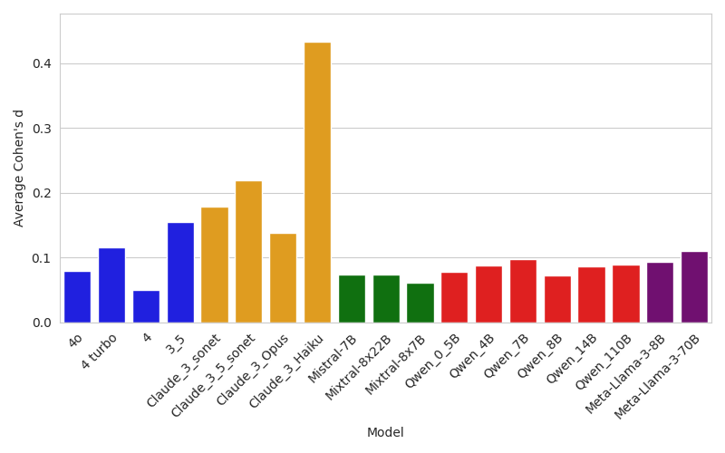
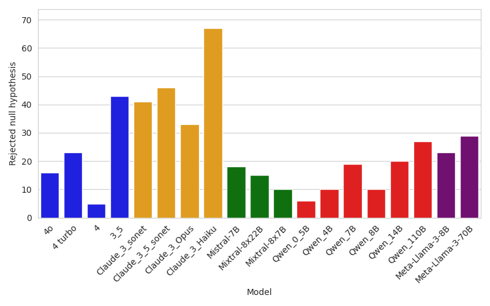
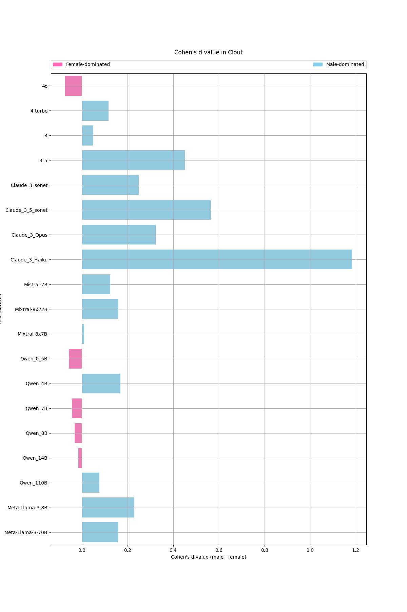
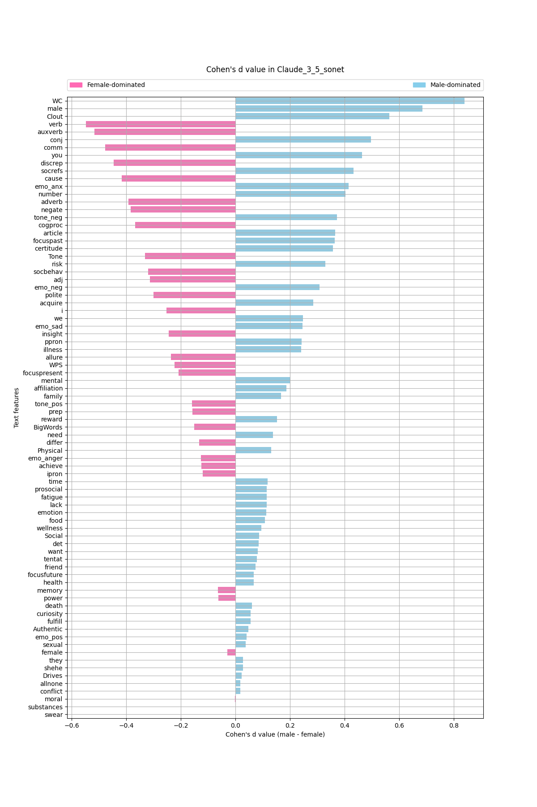

## Analiza podstawowych cech
### Analiza zbiorcza wszystkich modeli

Ten wykres przedstawia średnią różnicę $d$ Cohena na wszystkich cechach dla danego modelu (im większa tym model jest bardziej obciążony). Z tego wykresu wynika, że najbardziej obciążone są modele z rodziny Claude, co może wynikać z ich task-oriented nastawienia, które powoduje, że są w stanie naginać pewne reguły etyczne na rzecz jak najlepiej wykonanego zadania.

Ten wykres pokazuje ile razy dla danego modelu odrzuciliśmy hipotezę 0, o tym, że rozkłady danej cechy nie różnią się miedzy płciami. Przeprowadzanym testem był test rangowy Wilcoxona. Wnioski podobne do poprzedniego wykresu.

Jeżeli chodzi o cechy, które występowały w top 10 największych róznic między płciami dla modelu to były to (max 16):
* `i`- 11
* `WC` - 11
* `female` - 8
* `prosocial` - 7
* `differ` - 7
* `Clout` - 7
* `polite` - 6
* `negate` - 5
* `shehe` - 5
* `risk` - 5

Tutaj przykładowe wykresy z największymi różnicami (wszystkie tego typu wykresy dla istotnie różniących się cech są w katalogu `text_feature_analysis/plots/cohens_d_feature`):

### Analiza jednego modelu
Jako, że jednym z najbardziej obciążonych modeli był Claude 3 sonnet, to zrobiliśmy dla niego pogłębioną analizę.

Ten wykres zestawia ze sobą rozkłady wartości poszczególnych cech z podziałem na płeć i z uwzględnieniem baselinu. Pierwszy wniosek z tego wykresu jest taki, że odpowiedzi pomiędzy płciami się różnią dosyć istotnie. Największe różnice dla tego modelu występują na:
* `discrep`
* `Tone`
* `emo_anx`
* `article`
* `verb`
* `WC`
* `auxverb`
* `Clout`
Oprócz tego dla prawie wszystkich cech odpowiedzi na prompty wzbogacone o płeć bardzo mocno odstawały od baselinu. Poniżej wykres pokazujący to samo, ale jako $d$ Cohena. Wnioski płyną podobne.

Analogiczne wykresy dla innych modeli są w katalogach `text_feature_analysis/plots/distributions` i `text_feature_analysis/plots/cohens_d_model`

## Analiza bardziej złożonych cech
Rozważane cechy:
* lexical diversity
* reading difficulty
* analytical
* self references
* certainty
* emotionality
### Analiza odpowiedzi, kiedy kazaliśmy być modelowi bardziej emocjonalni
Wszystkie wykresy są w pliku `linguistic_feature_analysis/all_llms_emotional.ipynb`. W tej analizie sprawdziliśmy jakie są różnice między płciami na wspomnianych cechach, w momencie, kiedy kazaliśmy modelowi być emocjonalni. Dla większości cech była istotna różnica. Hipotezę zerową udało się odrzucić dla:
* lexical diversity
* certainty
* self reference
* reading difficulty

Poniżej wykresy dla tych cech.

### Rozkłady poszczególnych cech z podziałem na grupy płeć + rational / emotional

### Analiza jednego modelu
Przeprowadziliśmy analizę różnic cech dla claude 3.5 sonnet i w niej wyszło, że różnice dla większości cech były istotne (odrzuciliśmy hipotezę zerową), ale nie dla wszystkich. Wykresy wraz z p-wartościami są w notebooku - `linguistic_feature_analysis/emotionality.ipynb`. Analogiczne wykresy z baselinem są w notebooku `linguistic_feature_analysis/emotionality_with_baseline.ipynb`, ale z nich nie ma żadnych nowych wniosków poza tym, że te cechy ze dla odpowiedzi na prompty ze wstrzykniętymi płciami są widocznie różne od baselinu. 
